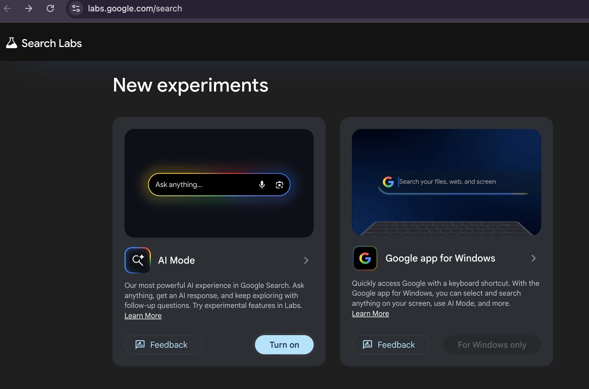
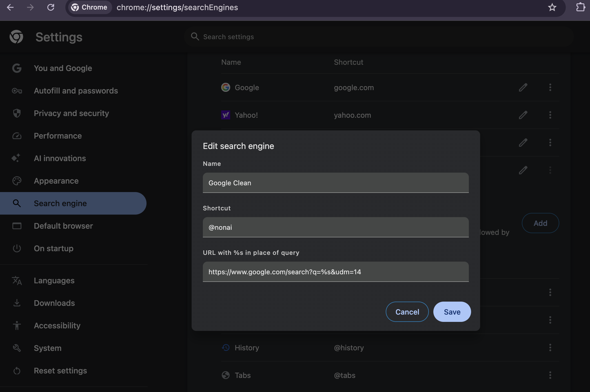

# MacBook Setup Guide (Personal)

A personal checklist and command reference for setting up a clean, lean, and secure MBP — optimized for dev use with minimal bloat.

---

## 1. Install Homebrew

Run this in Terminal and press `RETURN` when prompted:

```bash
/bin/bash -c "$(curl -fsSL https://raw.githubusercontent.com/Homebrew/install/HEAD/install.sh)"
```

> ⚠️ This will also install **Xcode Command Line Tools** — let it finish before moving on.

After the installer completes, add Homebrew to your PATH:

```bash
echo 'eval "$(/opt/homebrew/bin/brew shellenv)"' >> ~/.zprofile
eval "$(/opt/homebrew/bin/brew shellenv)"
```

Verify it works:

```bash
brew doctor
```

---

## 2. Install Dev Tools

Run each line **individually**:

```bash
brew install git
```
```bash
brew install node
```
```bash
brew install python
```
```bash
brew install wget
```
```bash
brew install gh        # GitHub CLI — manage repos from terminal
```
```bash
gh auth login          # authenticate gh with your GitHub account (browser flow)
```
```bash
brew install tree      # visualize directory structure
```

---

## 3. Install GUI Apps (Casks)

```bash
brew install --cask rectangle    # window snapping (macOS lacks this natively)
```
```bash
brew install --cask raycast      # better Spotlight: launcher + clipboard history
```

> **Web-first philosophy:** Notion, Slack, Figma etc. work fine in Chrome — skip native apps until you feel the need.

---

## 4. System Monitoring

Install a better process viewer:

```bash
brew install htop    # interactive, better than top
```
```bash
brew install btop    # even prettier — shows CPU, memory, disk, and network
```

Quick native checks (no install needed — run each separately):

```bash
top -o mem           # sort processes by memory usage — press q to quit
```
```bash
vm_stat              # raw virtual memory stats
```
```bash
memory_pressure      # simple health check: outputs good / warning / critical
```

---

## 5. Periodic Cleanup

Run these occasionally to keep things tidy:

```bash
brew cleanup         # removes old versions of installed packages
```
```bash
brew autoremove      # removes unused dependencies
```
```bash
brew upgrade         # updates all installed packages
```

---

## 6. Privacy & Security

### macOS System Settings (no installs needed)

| Setting | Where |
|---|---|
| Turn on **Firewall** | System Settings → Privacy & Security → Firewall |
| Enable **FileVault** (full-disk encryption) | System Settings → Privacy & Security → FileVault |
| Restrict **AirDrop** | System Settings → General → AirDrop → Contacts Only (or Off) |
| Disable **Analytics** | System Settings → Privacy → Analytics → turn off |

### Disable Google AI Mode in Search

**Step 1 — Account-level (all browsers):**
Go to [labs.google.com/search](https://labs.google.com/search) — make sure the "AI Mode" is turned off.



**Step 2 — Chrome: force clean results as default:**
1. `chrome://settings/searchEngines` → under Site search → **Add**
2. Fill in:
   - Name: `Google Clean` (set your customized Name and shortcut)
   - Shortcut: `@nonai`
   - URL: `https://www.google.com/search?q=%s&udm=14`
3. Find it in the list → click ⋯ → **Make default**



**Step 3 — Safari:**
Safari doesn't support custom search engines natively. Cleanest fix: set default search engine to **DuckDuckGo** — no AI results, no tracking.
System Settings → Safari → Search Engine → **DuckDuckGo**

### Chrome Settings

- `chrome://settings/cookies` → Block third-party cookies
- `chrome://settings/privacy` → Enable Enhanced Protection

### Chrome Extensions

> ⚠️ **uBlock Origin heads-up:** The full uBlock Origin was removed from the Chrome Web Store in late 2024 due to Google's Manifest V3 changes. For Chrome, install **uBlock Origin Lite** (reduced but still solid). For full ad-blocking, switch to **Firefox** or **Brave**.

| Extension | Purpose | Link |
|---|---|---|
| **uBlock Origin Lite** | Ad & tracker blocking (Chrome) | [Install](https://chromewebstore.google.com/detail/ublock-origin-lite/ddkjiahejlhfcafbddmgiahcphecmpfh) |
| **Snowflake** | Donate bandwidth to help users in censored countries reach Tor | [Install](https://chromewebstore.google.com/detail/snowflake/mafpmfcccpbjnhfhjnllmmalhifmlcie) |

> 💡 **Snowflake** is by the Tor Project — runs silently in the background. When the icon turns green, a censored user is tunneling through your connection. Your IP is not exposed to the sites they visit.

---

## 7. App Stack (Minimal)

| App | Purpose | Install |
|---|---|---|
| **Chrome** | Browser | [google.com/chrome](https://www.google.com/chrome) |
| **Rectangle** | Window management | `brew install --cask rectangle` |
| **Raycast** | Launcher + clipboard | `brew install --cask raycast` |
| **Bitwarden** | Password manager | `brew install --cask bitwarden` |
| **JetBrains IDE** | Dev (when edu license renewed) | [jetbrains.com](https://www.jetbrains.com) |

---
## 8. Terminal Helper

**Syntax highlighting** — color-codes commands as you type (green = valid, red = unknown):

```bash
brew install zsh-syntax-highlighting
```
```bash
echo "source $(brew --prefix)/share/zsh-syntax-highlighting/zsh-syntax-highlighting.zsh" >> ~/.zshrc
```
```bash
source ~/.zshrc
```

**Fuzzy history search** — press `Ctrl+R` to search all past commands interactively:

```bash
brew install fzf
```
```bash
$(brew --prefix)/opt/fzf/install
```

---

## Tips
- `#` comments in shell scripts are fine in `.sh` files, but pasting them into an interactive terminal causes errors

---

*Last updated: April 2026*
